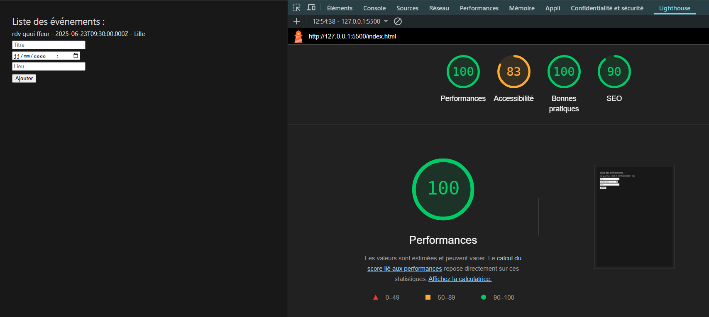
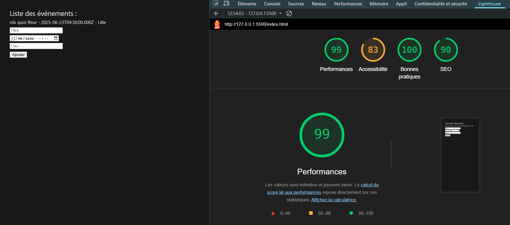

# ECO CONCEPTION

Ce projet est un site web qui a pour but de nous sensibiliser à l'écologie dans l'IT, plus particulièrement dans la conception de nos applications.
Pour cela, nous avons eu comme sujet de créer un site web qui serait éco-conçue qui nous permettrait de consulter et ajouter des
événements à venir.

## Technologies utilisées

Nous avons décidé d'utiliser Vue.js en tant que framework pour la partie front-end et Express pour la partie back-end.

Pourquoi Vue ? 
- Vue.js est un framework qui est très performant déjà par rapport à sa taille relativement faible ce qui permet une moins grosse charge réseau.
- Il permet aussi de créer des composants optimisés et d’éviter le gaspillage de ressources.
- Le virtual DOM permet de ne mettre à jour que les éléments qui ont changé, ce qui permet de réduire la consommation de ressources.
- On a aussi la possibilité d'utiliser le server side rendering pour améliorer la performance de notre site.
- Des pages statiques peuvent être générées pour les pages qui ne changent pas souvent. 

Pourquoi Express ?
- Express est un framework qui est très léger et qui permet de créer des applications web de manière très simple.
- On peut aussi facilement se servir de pages statiques.
- Il contient uniquement le nécessaire en terme de librairies ce qui permet de réduire la consommation de ressources.
- L'asynchronisme permet de ne pas bloquer le serveur lors de l'exécution de tâches longues, grâce à Node.js.

Pour les requêtes au lieu de nous diriger vers Axios, nous avons décidé d'utiliser Fetch qui est une API native de JavaScript qui permet de faire des requêtes HTTP.
La raison pour cela est que d'abord Fetch est plus léger qu'Axios, de plus le fait qu'il soit natif permet de ne pas avoir à installer de dépendances supplémentaires
et donc de pas surcharger notre application.
Concrètement pour notre utilisation, Fetch est suffisant pour les requêtes que nous avons à faire.

CORS est une librairie qui permet de gérer les requêtes HTTP entre différents serveurs, c'est une librairie qui est très utilisée et qui est très simple à mettre en place.
Dans notre utilisation elle nous permettrait de mieux configurait notre serveur et de mieux gérer les requêtes.
Par exemple en limitant les requêtes préliminaires.

## BDD

Tout d'abord lors de la création de notre base de données, nous avons décidé d'utiliser MySQL2 pour la gestion de notre base de données.
MYSQL2 est simplement plus optimisé que MySQL et permet de gérer plus de requêtes en même temps, il support les async et await.

De plus, nous avons utilisé Sequelize, c'est un ORM qui permet de simplifier la gestion de la base de données.
Nous avons décidé de rester sur celui-ci, car le gain performances/ressources est très intéressant et permet de simplifier la gestion de la base de données.

D'une autre part, nous avons fait le choix de prendre InnoDB comme moteur de stockage pour notre base de données.
InnoDB est un moteur de stockage qui fait moins d'opérations inutiles que MyISAM, donc le choix était évident.

## Type de données 

Nous n'avons qu'une seule table dans notre base de données qui est la table "events".
Cette table contient les colonnes suivantes :

- id : int, auto increment, primary key
- title : varchar(255)
- description : text
- date : datetime
- location : text

Et les colonnes created_at et updated_at qui sont gérées par Sequelize.

Il y a un choix qui a été réfléchi pour les types de données, nous avons décidé de mettre le type datetime pour la colonne date,
car cela permet de ne pas avoir à gérer les dates dans le code et de ne pas avoir à faire de conversion de type.
Le title et la description ne possède pas le même type parce que le title est un champ qui est plus court et qui ne nécessite pas de stocker beaucoup de données,
ce serait donc inutile de mettre un type text pour le title, car on perdrait en performances (même si c'est très minime).
Contrairement à la location qui utilise aussi le text. 
Pour finir, l'id est un int car c'est un identifiant et que c'est un type de données qui est plus rapide à traiter.

## Encodage

L'encodage de la base de données est en utf8mb3_general_ci, cela permet de supporter les caractères spéciaux.
Pourquoi le mb3 plutôt que le mb4 ? Car le mb4 est plus lourd et que nous n'avons pas besoin de supporter les émojis.

## Sources

VUE :
- https://fr.vuejs.org/guide/extras/rendering-mechanism

EXPRESS :
- https://www.geeksforgeeks.org/express-js/?ref=shm
- https://laconsole.dev/formations/express/fichiers-statiques
- https://node-js.fr/express/middleware.html

## LightHouse

Nous avons aussi utilisé LightHouse afin de mesurer les performances et les bonnes pratiques de notre application web.

### Desktop



### Mobile



# Déploiement FRONT

## Installation

```sh
npm install
```

## Lancement

```sh
npm run dev
```

# Déploiement BACK

## Installation

```sh
npm install
```

## Lancement

```sh
node server
```


